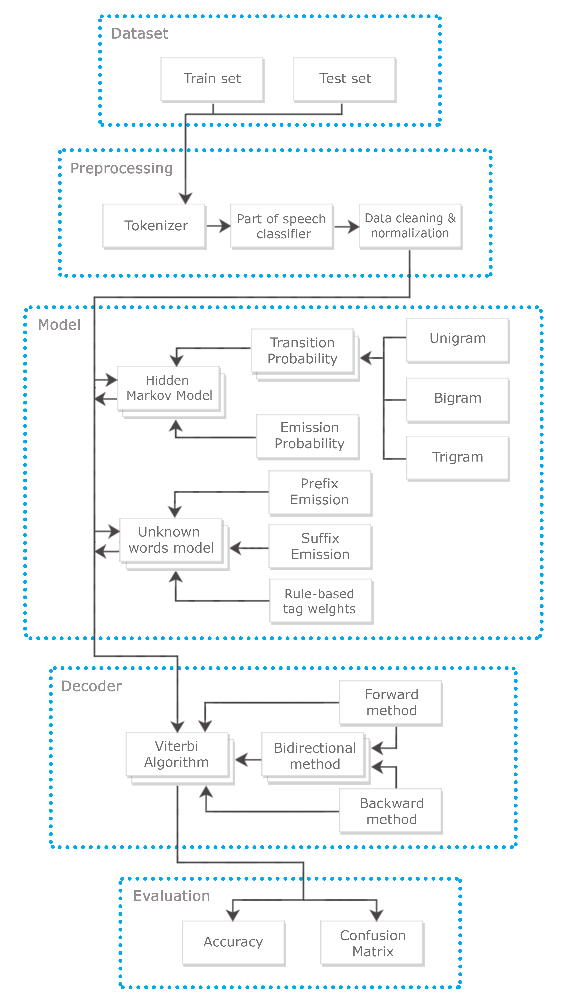
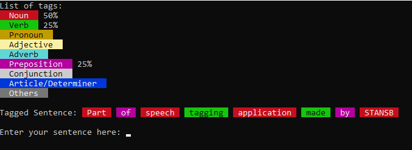

# part-of-speech-tagging-library
## Information
A natural language processing library for automatic part-of-speech tagging  
Tags used in the process are the following: Noun, Verb, Article/Determiner, Preposition, Adjective, Pronoun, Conjuction, Others.  
Passed the **96%** overall accuracy threshold for the **Brown Corpus**  

## Installing & Using the library
+ In terminal, write:  **git clone https://github.com/ST4NSB/part-of-speech-tagging.git**
+ Go to your project 
+ Add the Reference to your project -> [./src/bin/Debug/netstandard2.0/**Nlp-PosTagger.dll**]
+ To import all POS tagging classes, add **using NLP;** to your application header

## Library Arhitecture

More info about the system at ./docs/Documentatie_pos_tagging.docx (in Romanian)  

## Demo Application
To run the demo Open & Run: **Program.cs**  

Example of a tagged sentence:  

## MIT License
Copyright (c) 2019 Bărbulescu Adrian

Permission is hereby granted, free of charge, to any person obtaining a copy
of this software and associated documentation files (the "Software"), to deal
in the Software without restriction, including without limitation the rights
to use, copy, modify, merge, publish, distribute, sublicense, and/or sell
copies of the Software, and to permit persons to whom the Software is
furnished to do so, subject to the following conditions:

The above copyright notice and this permission notice shall be included in all
copies or substantial portions of the Software.

THE SOFTWARE IS PROVIDED "AS IS", WITHOUT WARRANTY OF ANY KIND, EXPRESS OR
IMPLIED, INCLUDING BUT NOT LIMITED TO THE WARRANTIES OF MERCHANTABILITY,
FITNESS FOR A PARTICULAR PURPOSE AND NONINFRINGEMENT. IN NO EVENT SHALL THE
AUTHORS OR COPYRIGHT HOLDERS BE LIABLE FOR ANY CLAIM, DAMAGES OR OTHER
LIABILITY, WHETHER IN AN ACTION OF CONTRACT, TORT OR OTHERWISE, ARISING FROM,
OUT OF OR IN CONNECTION WITH THE SOFTWARE OR THE USE OR OTHER DEALINGS IN THE
SOFTWARE.

